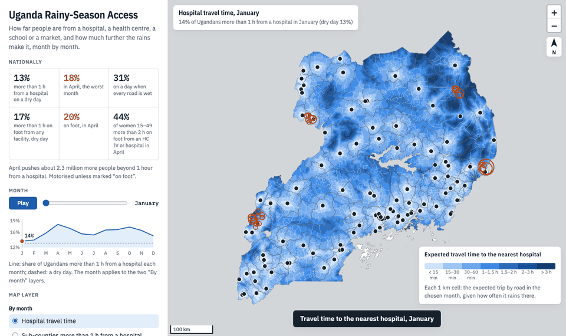
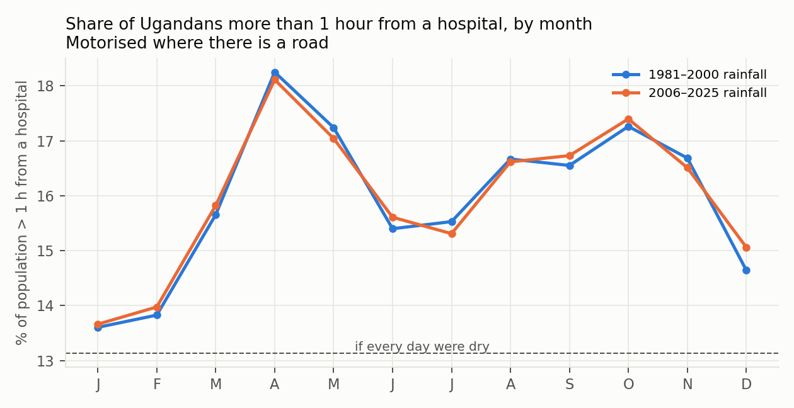
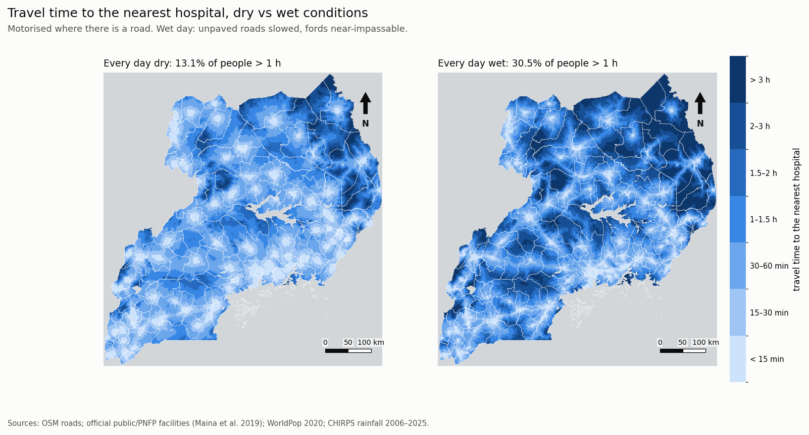
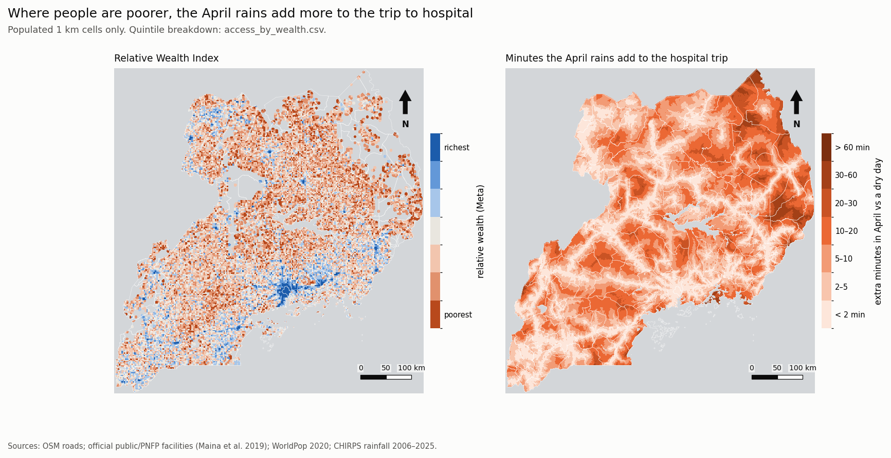
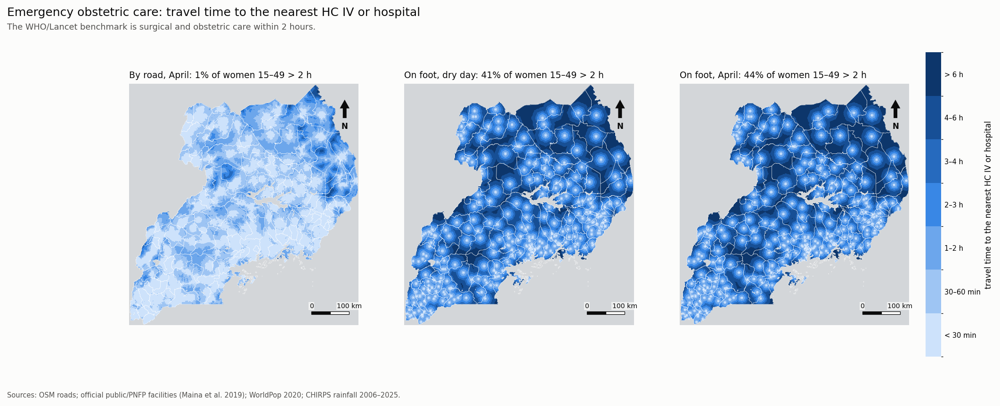
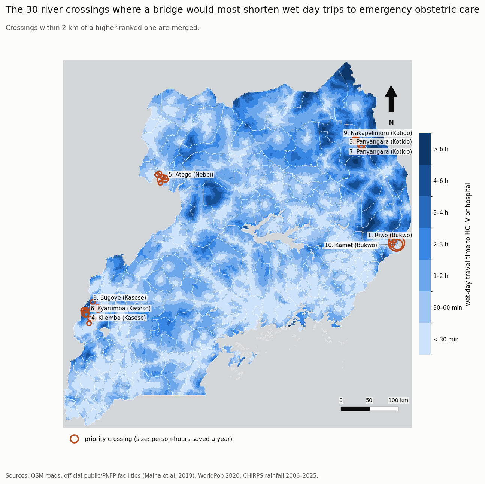

# When the Rains Come, the Hospital Moves Further Away

*Mapping how Uganda's rainy seasons lengthen the journey to care, school and market, sub-county by sub-county.*

---

*A tour of the interactive map. Explore it yourself: https://gavacharles.github.io/uganda-rainy-season-access/*

---

## It started with a different question

We were working on something else entirely.

The original research asked whether Uganda's historical weather data could help contractors plan construction programmes better. How have the seasons changed? When does rain stop earthworks? Should a road contract that starts in January be priced differently from one that starts in May? We went through 45 years of daily satellite rainfall, counting the days in each region when rain stops a grader or a paver.

Somewhere in that work, while staring at charts of "lost working days", a thought crossed my mind. If rain stops a contractor's earthworks, what does it do to everyone else using the same murram roads? To the mother in labour, the boda boda heading to the health centre, the child walking to school, the farmer taking produce to market?

Rain doesn't only delay road projects. It moves the hospital further away.

So we built a map to measure how much.

## What we did

We divided Uganda into about 244,000 squares of 1 km, each with its population, and worked out how long it takes to reach the nearest hospital, health centre, school, market or town:

- **Roads** come from OpenStreetMap: about 690,000 road segments, each with its class and, where recorded, its surface.
- **Health facilities** come from the Ministry of Health's list of public and not-for-profit facilities, which records whether each is a hospital, a Health Centre IV or a smaller unit.
- **Rain** comes from the same 45 years of satellite data (CHIRPS). For every square and every month, we know how often the day is wet enough to turn murram to mud.
- **On a wet day,** unpaved roads slow down sharply, and roads that cross a river by a ford become close to impassable.

We ran the model month by month, by road and on foot. Then we broke the results down by sub-county, by wealth, for women of reproductive age, and for areas hosting refugees.

These are modelled estimates, not measured trips, but they are grounded in real roads, real facilities, real people and real rain. At the end we check them against what Ugandans themselves report.

## 1. The year has a shape, and April is its worst month

If no day were ever wet, **13% of Ugandans would live more than an hour from a hospital.** In April, the heart of the long rains, that rises to **18%**. That is roughly **2.3 million more people** beyond the one-hour mark. A second, smaller peak follows the short rains in October. On a day when every road is wet, the figure reaches **31%**.

One thing surprised us, given where this started. The long-term trend in rainfall hardly moves these numbers: April in the last twenty years looks much like April in the 1980s and 90s. **The seasonal cycle is the story, not the trend.** It happens every single year, and it is predictable.

## 2. The rains fall on everyone, but the burden doesn't

This is the finding we keep coming back to.

We placed the model alongside Meta's Relative Wealth Index, a high-resolution estimate of how well-off each area is, and split the population into five equal groups from poorest to richest.

- **By road:** among the poorest fifth of Ugandans, **23%** are more than an hour from a hospital on a dry day, rising to **32%** in April. Among the richest fifth, it is under **1%**, rain or shine.
- **On foot, to any health facility:** the poorest fifth go from **31%** to **37%**. The richest fifth stay at about **1%**.

The poorest start furthest away, and the rains add the most to their journeys. Wealthier areas are close to facilities and on better roads, and the seasons barely touch them. The seasonal gap is an inequality gap, and it repeats every year on a timetable we already know.

## 3. Where the rains bite hardest

National averages hide a lot, so we went down to all 1,520 sub-counties. The biggest seasonal swings come where many people live **just under an hour** from a hospital on a dry day: the rains tip them over.

- **Malongo, Mayuge:** 59% of people are more than an hour from a hospital on a dry day, **93% in April**.
- **Kagulu, Buyende:** 33% becomes **66%**.
- **Butoloogo, Mubende:** 26% becomes **84%**.
- **Kyangwali, Kikuube,** home to a large refugee settlement: 54% becomes **77%**.

More broadly, sub-counties with a mapped refugee site see 22% of people beyond an hour on a dry day and 33% in April, against 13% and 18% elsewhere.

The worst month differs by region. It's April across most of the south and centre, but August or October across the north, where there is one long rainy season. Planning around "the rainy season" as a single national event misses this.

## 4. Walking is the real barrier, especially for mothers

The internationally used benchmark for emergency obstetric care is being within **two hours** of a facility that can perform surgery. In Uganda, that means a Health Centre IV or a hospital.

- **By road:** about **1%** of women aged 15–49 are more than two hours away.
- **On foot:** **41%** are more than two hours away on a dry day, and **44%** in April.

The gap between those two numbers is transport. A woman with a boda boda or a vehicle at hand is almost always within reach. A woman who has to walk often is not, and the rains make it worse.

Even for the nearest health facility of any level, the first point of care, **17%** of people are more than an hour away on foot, rising to **20%** in April.

## 5. It isn't only health

We ran the same model for other everyday destinations. Between a dry day and April, the share of people more than an hour away by road rises:

| Destination | Dry day | April |
|---|---|---|
| Market | 17% | 21% |
| Town | 6% | 9% |
| Secondary school | 2% | 3% |
| Secondary school, on foot | 27% | 30% |

Every one of these is a trip that the rains make longer or skip altogether: produce that doesn't reach market, a lesson missed, a clinic visit postponed.

## 6. Some fixes are very specific

Two results point to things that could actually be done.

**Hospitals that lose most in April.** For each hospital, we looked at the people for whom it is the nearest hospital, and counted how many are pushed beyond an hour in April. The largest are the catchments of **Mubende Regional Referral Hospital** (about 155,000 people), **Lira Regional Referral Hospital** (141,000), **Kamuli** (127,000), **Kagadi** (118,000) and **Pallisa** (108,000). Those are natural places to position ambulances, maternity waiting shelters and outreach before the rains arrive.

**River crossings that need a bridge.** We tested every ford on the road network: if this one crossing had a bridge, how much faster would wet-day trips to emergency obstetric care be?

The top-ranked crossing, on a secondary road in **Riwo sub-county, Bukwo**, on the slopes of Mt Elgon, would bring about **7,000 people** within an hour of emergency obstetric care on wet days. That includes about **1,500 women** of reproductive age. Next come crossings in **Karita (Amudat)** and **Panyangara (Kotido)**. A few culverts or small bridges in the right places could matter more than kilometres of new road elsewhere.

## How much should you trust this?

A model is only as good as its inputs, so we tested it in three ways.

- **Does it match what people say?** Uganda's 2016 Demographic and Health Survey asks women whether distance stops them getting health care. Across the survey's 15 regions, our modelled access lines up closely with how many women cite distance: a rank correlation of about **0.8**, which stays significant after allowing for wealth. It does **not** predict facility births at regional level. Karamoja, for example, has poor access but high facility delivery rates, probably thanks to targeted programmes, and we report that honestly.
- **Does it depend on our assumptions?** We re-ran it 16 ways, changing how much wet roads slow down, how fords behave, road speeds, walking speed and how wet a "wet day" must be. The seasonal rise appears in every version, and the ranking of districts barely changes. The **size** of the April rise depends most on how wet a wet day has to be, somewhere between 1 and 10 percentage points, with 5 points as our central estimate.
- **What it can't see.** OpenStreetMap is more complete in some areas than others, and most roads don't record their surface. The facility list leaves out private for-profit clinics. Ferries aren't modelled, so island communities in Kalangala and Buvuma appear cut off. And a model is not a travel diary: it describes what the roads allow, not what every family actually does.

## What this could mean

- **Time maintenance before April.** Grading and drainage work on the unpaved roads that feed health facilities is worth most when finished before the long rains, not during them. This brings us back to where we started: when a road contract slips into the rainy season, it delays the road and extends the isolation it was meant to fix.
- **Plan by season and by place.** District health teams could use the worst-month maps to pre-position ambulances, stock and outreach, and to encourage maternity waiting homes in the sub-counties that tip past an hour when it rains.
- **Bridge the right crossings.** The crossing ranking is a starting list for district engineers, to be checked on the ground.
- **Put the poorest first.** The seasonal burden falls hardest on the poorest fifth, so seasonal access deserves a place in how resources are targeted.

## Explore the map

Everything above, and much more, is in the interactive map:

**https://gavacharles.github.io/uganda-rainy-season-access/**

Press **Play** to watch the year go by. Switch between hospitals, health centres, schools and markets, by road or on foot. Click any sub-county to see its numbers, or any crossing to see what a bridge would change. It works on a phone, and if you download the page it works offline.

If you work in a district health office, a district engineering team, or with communities in any of the places named here, I would love to hear whether this matches what you see on the ground, and what we have got wrong.

---

*Data: roads © OpenStreetMap contributors (ODbL); Ministry of Health public and not-for-profit facility list as geocoded by Maina et al. (2019); WorldPop 2020 population and age structure; CHIRPS daily rainfall (Climate Hazards Center, UC Santa Barbara), 2006–2025; administrative boundaries from HDX COD-AB; Meta Relative Wealth Index; Uganda DHS 2016 via the DHS Program API. Travel times are modelled estimates.*
